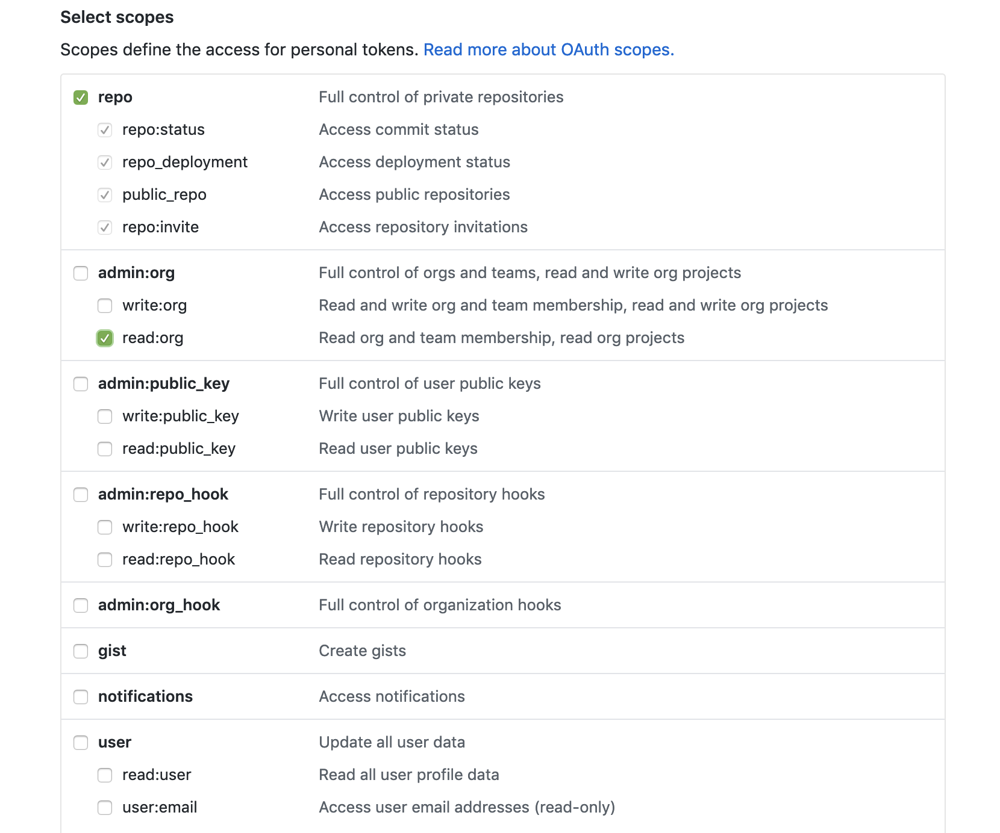

# Alfred Github Workflow

Heavily inspired (some might say copied /shrug) by https://github.com/edgarjs/alfred-github-repos.

Benefits of using this workflow:

- Fuzzy query filtering
- The refresh action isn't triggered if you mistype a repo name and press enter
- Repos are loaded asynchronously and much faster

## Installation
#### Install workflow into Alfred

Find the latest workflow file over in the releases tab or [click here to download it directly](https://github.com/lampo/alfred-github-workflow/releases/latest/download/Github.alfredworkflow).
Double-click the file and it will install the workflow.

## Setup

To create the API token needed by this workflow:

1. Go to the [Personal access tokens page](https://github.com/settings/tokens)
2. Click `Generate new token` (might have to confirm password)
3. Give a descriptive name (like `alfred github workflow`) for reference later
4. Select `repo`
5. Select `read:org`
6. Click `Generate token`
7. Copy the token value
8. In Alfred enter `gh-auth` with a space and paste the token.  Should look like: `gh-auth ACCESS_TOKEN_HERE`




Your repos should be loaded automatically.  If you ever want to refresh the list of available repos, you can enter `gh-refresh` and it will update the repo list in the background and notify when it is done.

## TODO

Listed in order of what I want

- allow public repos to be searched for by the name of the user/org followed by a slash
  - make sure to cache the response for filtering
- Add alternative action to copy the link for SSH / HTTPS for easy cloning
- allow users/orgs to be added in the environment variables section so that they are always loaded even on refresh
- see your own notifications, pull requests, issues?
- maybe some other actions to get pull requests, issues, etc?

## Development, Testing, and Contributing
#### Contributing
When adding a new tag/release, you will need to run the install-libraries script to install dependencies into the `lib` directory.
Package new release with the files produced in the `lib` directory.
Install libraries with:

```bash
./install-libraries.sh
```
#### Development and Testing
When adding new dependencies, list them in the `requirements.txt`. To ensure correct install, clear out your local `lib`
directory and run install-libraries.sh again, then add workflow to alfred and test functionality.
